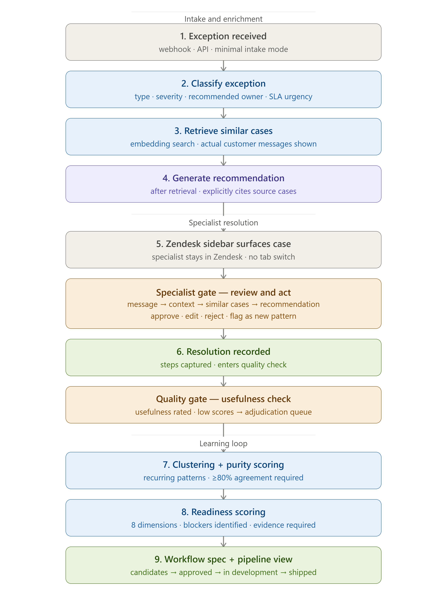
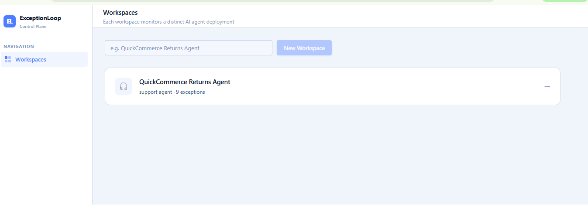
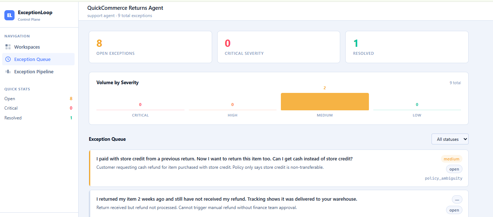

  <h1>ExceptionLoop</h1>

  
<strong>Operational control plane for AI agent exceptions.</strong>

  

    
    
    
    
    
    
  

  
<strong>Live: <a href="https://exceptionloop.vercel.app">exceptionloop.vercel.app</a> &nbsp;·&nbsp; <a href="https://exceptionloop.onrender.com/docs">API docs</a></strong>

---

## What is ExceptionLoop?

50% of enterprises have 10+ AI agents in production — each one generating its own exception category. Exception handling headcount grows with every deployment, and human resolutions disappear into unstructured ticket histories with no learning. **ExceptionLoop captures every exception with full context, retrieves similar resolved cases via vector search, generates a resolution recommendation, and converts recurring patterns into automation proposals.**

> **Exception in. Context captured. Resolution recommended. Pattern automated.**

---

## How It Works

---

## Key Features

- 🔍 **Vector Similarity Search** — pgvector retrieves the closest resolved cases before any recommendation is generated
- 🤖 **AI Resolution Recommendations** — Claude generates recommendations citing specific source cases, never from a blank slate
- 📋 **Two Intake Modes** — full structured API for instrumented agents, or Zendesk webhook for teams without agent access
- ✅ **Quality Gate** — usefulness ratings feed back into retrieval quality; low-rated resolutions are blocked from the learning pipeline at the data layer
- 🔗 **Zendesk Sidebar** — specialists resolve without leaving the ticket; no tab switching
- 📊 **Clustering Pipeline** — exceptions grouped by embedding similarity, purity-scored before readiness is assessed
- 📐 **8-Dimension Readiness Scoring** — frequency, consistency, risk, reversibility, policy clarity, data completeness, integration stability, evaluability
- 📄 **Workflow Spec Generator** — each automation step links to the human resolutions that produced it

---

## Tech Stack

**Backend** — FastAPI · SQLAlchemy 2.0 async · asyncpg · pgvector · PostgreSQL (Neon) · OpenAI text-embedding-3-small · Anthropic Claude

**Frontend** — Next.js 14 (App Router) · TypeScript · Clerk v5

**Infrastructure** — Neon (hosted Postgres + pgvector) · Render (backend) · Vercel (frontend)

---

## Screenshots

### Workspace list

Each workspace monitors one AI agent deployment. Exception volume is visible at a glance — the QuickCommerce Returns Agent has 9 cases in flight.

### Exception queue and dashboard

Volume by severity, open / critical / resolved counts, and the live exception queue with real customer messages and type tags. Specialists see actual customer language, not category labels.

---

## Design Decisions

**Recommendation generated after retrieval — always.** The recommendation service receives similar cases as a parameter and cannot run without them. Specialists read the evidence before the AI output, not after — preventing anchoring bias by design.

**`entered_pipeline` is a data-layer constraint.** Low-usefulness ratings (≤ 2) set this to `false` and route to adjudication. The clustering pipeline queries `WHERE entered_pipeline = true`. Bad feedback cannot contaminate the learning pipeline regardless of how the API is called.

**Cluster purity ≥ 80% before readiness scoring.** A cluster that scores 90% ready but contains 30% different root patterns creates silent automation failures after deployment. Purity is enforced as a gate, not a suggestion.

**Usefulness rating measures retrieval quality, not recommendation quality.** This is the signal the embedding system can improve on — not subjective approval of the AI's output.

---

## Portfolio Context

ExceptionLoop is the second project in an AI operations portfolio. The first, [PolicyLens AI](https://github.com/rajendergugulothu/policylens-ai), tests agents against policy before deployment. ExceptionLoop manages what breaks after deployment.

| | PolicyLens AI | ExceptionLoop |
|--|--------------|---------------|
| **When** | Before deployment | After deployment |
| **What** | Tests agents against policy | Manages escalations + learns from them |
| **Output** | Launch-readiness report | Automation pipeline |
| **North Star** | % decisions proven safe before prod | % recurring exceptions converted to automation |

Phase 0 discovery: 8 synthetic user research interviews and a manual concierge test on 47 real exception cases from a production returns agent. The concierge test found that 40% of all escalations over 2 weeks were a single recurring pattern — the loyalty points refund split — present for 4 months without being identified or automated.

---

## About

Built as a full-stack production-grade control plane — covering vector similarity search, async FastAPI, multi-stage AI pipelines, data-layer quality enforcement, and a Zendesk sidebar integration.

**Built by [Rajender Gugulothu](https://github.com/rajendergugulothu)**

---

  <em>ExceptionLoop — From exception to automation.</em>

